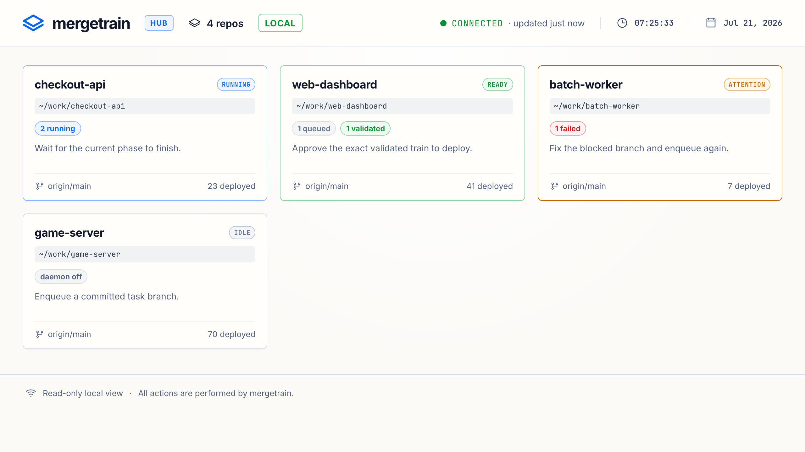

# mergetrain

[](https://github.com/yongjip/mergetrain/actions/workflows/ci.yml)
[](https://pypi.org/project/mergetrain/)
[](https://pypi.org/project/mergetrain/)
[](./LICENSE)

**A local-first merge-and-push queue for coding-agent worktrees.**

mergetrain keeps its queue, coordination, merge assembly, and gate execution on
your machine. Coding agents commit in separate worktrees; one local runner
serializes their branches, validates the exact train, and pushes only after
explicit approval. No hosted merge-queue service or CI provider is required.



Four guarantees shape the design: an **exact validated train identity** (the
train you approved is the train that ships, byte for byte), a **lease-fenced
single runner** (two processes can never race a push), an **atomic multi-ref
push**, and **crash-safe, exactly-once deploys** (after any crash, recovery
reconciles the local queue against the *remote*, so a landed train is never
re-pushed and a lost one is never mislabeled as shipped).

> **Local-first, not local-only.** Queue state, locking, train assembly, and
> gates stay local. Configured Git remotes and post-deploy verification may
> still use external services.

> Status: alpha (`v0.5.0`). The core is implemented and tested; interfaces may still change. Built to scratch my own itch first — published in case it scratches yours too.

---

## The problem

One repo, three coding-agent sessions running at once — Codex, Claude, whatever
— each in its own `git worktree` on its own branch: one adds a health check,
one refactors config loading, one fixes a flaky test. All three finish within
the same hour. Now what?

Without a queue, the ending is always one of these:

- **You become the merge coordinator.** Deciding landing order, rebasing each
  branch onto the last landing, rerunning the tests after every one — serially,
  by hand. The time you saved by running three agents in parallel is spent
  again integrating their results, and while you're integrating, you're not
  reviewing or directing.
- **Agents that push, race.** Two sessions push the same deploy branch within
  seconds: non-fast-forward rejects, a retry with `--force` that quietly
  clobbers the other session's landing, or an unreviewed merge combination
  shipping because whoever pushed last "won".
- **Green branches, red main.** Each branch passes its own tests, but two of
  them touched the same config loader in incompatible ways. No per-branch
  check can see that — only testing the *combined* result before it ships can.
- **Judgment calls land on an LLM.** Stale lock or live runner? Duplicate
  enqueue or a legitimate retry? Is unattended deploy actually approved for
  this job? These are exactly the calls you don't want an agent guessing at
  from fuzzy shell output.

### What mergetrain does about each

Each of those failure modes maps to a specific mechanism — this is the design,
not a feature list:

| Without a queue | With mergetrain |
|---|---|
| You order, rebase, and re-test every landing by hand | Agents **enqueue and stop**; one runner assembles the FIFO train in a throwaway worktree and lands it |
| Sessions race `git push`; a retry with `--force` clobbers | Agents never touch deploy refs; a **lease-fenced single runner** pushes atomically, exactly once |
| Green branches, red `main` | Gates run over the **exact combined train** before push; when a combination fails, the runner bisects it and names the conflicting pair (`conflict_with`) instead of shipping around the breakage |
| Stale locks, duplicate enqueues, "may I deploy?" become LLM guesses | Every state is JSON with an explicit `next_action`; deploys require explicit intent (`--deploy`), and unattended runs touch only pre-approved `--auto` jobs |
| The laptop dies mid-push | A write-ahead marker and pin ref let recovery ask the **remote** what landed — never re-pushed, never mislabeled |

That mapping is also the honest origin story: mergetrain exists because I was
running several coding-agent sessions on one repo and spending the hours they
saved me re-serializing their branches by hand. The queue was built to get
those hours back; the rest — validated train identity, crash recovery, the
multi-repo hub — followed from operating it every day. The parallelism you
paid for stays parallel.

### When to reach for it

- **Several agents, one project** — the core case, and the one it was built
  for: parallel worktree sessions on a single repo, landing their results all
  day without you serializing them by hand.
- **Unattended batches** — pre-approved `--auto` jobs land via the daemon
  while you're away; everything else waits for a human.
- **Agents across several repos** — the hub registers each repo and runs the
  same policy machine-wide, one repo's gates at a time.

One agent, one branch at a time? You don't need this — `git push` is fine.
And if your team is PR-first on a hosted forge with remote CI, use the
forge's native queue (see [alternatives](#alternatives--and-whats-different-here)).

Hosted merge queues (GitHub Merge Queue, GitLab Merge Trains, Mergify, Aviator, bors) solve a related problem, but they are PR-first, remote-CI-first, and platform-first. mergetrain is for the other workflow: **local-agent, worktree-first, deploy-branch-first.**

## How it works

```
  agent A ─┐
  agent B ─┼─▶  mergetrain queue (SQLite)  ─▶  one runner (lock)
  agent C ─┘                                      │
                                                  ▼
                          fresh integration worktree @ origin/main
                                merge A → B → C  (the train)
                                          │
                            gates (diff-check, tests, scans…)
                                          │
                              git push --atomic  →  configured refs
                                          │
                                  post-push verify hooks
```

Agents commit their work and **enqueue** a branch. They never push deploy refs themselves. A single **runner** (or unattended **daemon**) claims the queue, builds a throwaway integration worktree on top of your integration branch, merges the queued branches in FIFO order, runs your gates once over the whole train, and only then pushes — atomically — to your deploy refs. Every important state is readable as JSON so an agent can follow the result instead of inferring it.

## Quickstart

```bash
# Install the public alpha (zero runtime dependencies)
uv tool install mergetrain     # or: pipx install mergetrain
brew install yongjip/tap/mergetrain   # macOS, no Python needed
# No install at all? Try it first: uvx mergetrain --help

# 1. Scaffold config + agent docs in your repo
mergetrain init --project my-app --write

# 2. An agent finishes work, commits, and enqueues its branch
mergetrain enqueue --task "add health check" --branch agent/health --capture-sha

# 3. See the queue and lock state (machine-readable)
mergetrain status --json

# 4. Watch the queue and runner locally (read-only)
mergetrain dashboard

# 5. Validate the whole train without shipping
mergetrain run-batch --validate-only

# 6. Ship — explicit, never implicit
mergetrain run-batch --deploy
```

Here `deploy` is the backward-compatible name for the atomic Git ref update,
not necessarily a provider release. Repositories that reserve “deploy” for
TestFlight, Play, App Store, Kubernetes, or another downstream system can set
`terminology.git_operation: integrate` and use `run-batch --integrate`. This
changes human CLI, dashboard, wrapper, and generated-agent wording only;
SQLite/JSON keep the stable `deployed` status and `deploy_sha` field.

For an unreleased source checkout, use `python -m pip install -e .` instead.

The dashboard is served at `http://127.0.0.1:8765/`. It streams structured
runner phases, heartbeat freshness, job order, blocked reasons, recent activity,
the exact current gate and command template, and the next safe action. `CONNECTED`
describes the browser's data stream; `RUNNER ACTIVE` separately describes the
process that owns the train. It has no mutation endpoints or deploy controls.

Running agents across several repos? Register each one and serve every queue
on a single board:

```sh
mergetrain hub add ~/projects/app     # once per repo
mergetrain hub                        # one dashboard for the whole machine
```

The hub is the same read-only UI in multi-repo mode — repo cards with queue
counts, runner state, and the next safe action, each drilling down into the
full single-repo view. It owns no queue state: every repo entry is read from
that repo's own SQLite database, opened read-only, so observing a repo never
creates or migrates anything inside it. `mergetrain hub daemon` runs your
`--auto` work across those repos too, with a machine-wide concurrency cap
(default: one repo's gates at a time — parallel agents, but never parallel
engine builds). See [hub](./docs/hub.md).

Non-interactive callers can observe the same runner without starting a browser:

```sh
mergetrain inspect <job-id> --json
mergetrain events --job <job-id> --after 0 --follow --jsonl
mergetrain logs <job-id> --follow --tail 20
```

The event stream is resumable by persisted event ID and emits separate heartbeat
and terminal frames. Raw command output stays in the explicit local `logs`
command, not structured events.

Validation records an exact train identity, including every task HEAD and the
integration base used for the check. The later deploy reassembles that same
train on the current integration ref, reruns all gates, and refuses changed
task branches. Newly queued work is not silently added to the approved train.
Expensive gates may be reused only through an explicit validated-reuse policy or
`--reuse-validated`; a non-deploying `--preview --json` reports the exact reused SHA
or why the full safe path will run.

Every agent-facing command is non-interactive and requires explicit intent: `--validate-only` or `--deploy`, never a bare `run-batch`.

## Core concepts

- **Job** — one task branch waiting in the queue, with the SHAs captured at enqueue time.
- **Validated train** — an exact, deployable group of jobs that passed gates together and is waiting for explicit deploy approval.
- **Runner lock** — gives every claim a unique lease token, heartbeats through long-running commands, and prevents a stale runner from overwriting a newer owner.
- **Run event** — a persisted, secret-conscious phase transition with an integer resume cursor; follow mode adds ephemeral heartbeat and terminal frames.
- **Integration worktree** — a disposable, detached Git worktree built on your integration ref. The runner merges here, so agents never checkout or push the deploy branch.
- **Gate** — a verification command (diff-check, tests, secret-scan…) run once over the assembled train *before* push. A gate failure means nothing ships.
- **Verify hook** — a command run *after* push to confirm the deploy is live.
- **Auto job** — a job enqueued with `--auto`, the only kind the unattended daemon will touch. Manual jobs are left for a human-initiated runner.

Full reference in [docs/design.md](./docs/design.md) and the [CLI reference](./docs/cli.md).

## Alternatives — and what's different here

Every established merge queue assumes a forge app, webhooks, and a hosted CI
provider. mergetrain assumes a laptop, worktrees, and `git push`.

| Category | Examples | They assume | mergetrain |
|---|---|---|---|
| Forge-native queues | [GitHub Merge Queue](https://docs.github.com/en/repositories/configuring-branches-and-merges-in-your-repository/configuring-pull-request-merges/managing-a-merge-queue), [GitLab Merge Trains](https://docs.gitlab.com/ci/pipelines/merge_trains/) | PRs + the forge's CI; for private repos, Enterprise Cloud (GitHub) or Premium (GitLab) as of mid-2026 | No forge app, no plan gate — any Git remote |
| Merge-queue SaaS | [Mergify](https://mergify.com), [Aviator](https://www.aviator.co/merge-queue), [Trunk](https://trunk.io/merge-queue), [Graphite](https://graphite.com) | A GitHub App + webhooks + your CI provider + per-seat pricing | Queue state never leaves your machine |
| Self-hosted bots | bors lineage, [Zuul](https://zuul-ci.org/), Marge-bot | A server you operate + forge webhooks + CI | One `pip install`, zero runtime dependencies, no server |
| Local agent queues | [claude-code-merge-queue](https://github.com/funador/claude-code-merge-queue) | Also local-first: lands queued branches one at a time (rebase → check → push), built around Claude Code's worktree hooks | Batched **validated trains** with an exact approved identity, SQLite-durable state, remote-reconciled crash recovery, and harness-agnostic operation (Codex, Claude, anything that can run a CLI) |

If your team is PR-first on a hosted forge with remote CI, use the native
queue — that is exactly what it is for. mergetrain is for the other workflow:
**local coding agents in worktrees, shipping to a deploy branch, with or
before any PR.**

### The crash story, specifically

A hosted queue's crash recovery is its vendor's uptime page. A local queue
runs on a laptop — which loses power, sleeps mid-push, and gets its terminal
killed. mergetrain treats that as the normal case, not the exception: every
push is preceded by a durable write-ahead marker and a
`refs/mergetrain/pending/<id>` pin ref, so `mergetrain recover` can ask the
**remote** what actually happened. A train is marked `deployed` only when a
push ref carries its SHA, a landed train is never pushed twice, and deploys
are refused while any job still needs reconciling. As far as we can tell, no
other merge queue — hosted or local — documents an exactly-once push contract
at all; the full failure catalogue is in
[failure modes](./docs/failure-modes.md).

mergetrain is **not** a general-purpose job queue (it won't replace Celery/RQ/Sidekiq), a CI provider, or a deploy provider. The core is provider-neutral: your push targets, test commands, and deploy checks live in config, not in mergetrain.

## Configuration

A single `.mergetrain.yaml` at your repo root holds all policy. The core stays neutral; you bring the commands.

```yaml
project:
  name: my-app

git:
  remote: origin
  integration_branch: main
  push_refs: [main]          # atomic push targets on deploy

terminology:
  git_operation: integrate  # deploy (default), integrate, or push

queue:
  lock_ttl_minutes: 30
  heartbeat_interval_seconds: 10
  command_timeout_seconds: 3600

gates:
  - name: diff-check
    run: git diff --check ${integration_ref}..HEAD
  - name: tests
    run: python -m pytest

deploy:
  verify:
    - name: live-health
      run: curl -fsS https://example.invalid/health
```

See the [config reference](./docs/config.md) for the full schema, placeholders, and environment variables.

## For AI agents

mergetrain is designed so an agent can operate it from a short contract and JSON output, without guessing:

1. Work on a task-specific branch in its own worktree.
2. Commit before enqueuing.
3. Never push deploy refs directly.
4. Read `mergetrain doctor --json` / `status --json` before acting.
5. Use `--auto` only after explicit human approval for unattended deploys.
6. Let one runner or daemon own merge → test → push → verify.
7. Fix `blocked`/`failed` work on the owning branch and enqueue a fresh clean job.

When `doctor --json` says `wait_for_runner`, use `inspect --json` or a scoped
`events --follow --jsonl` stream instead of probing the OS process tree.

`mergetrain init` writes `AGENTS.mergetrain.md` / `CLAUDE.mergetrain.md` so your agents pick this up automatically.

## Documentation

- [Quickstart](./docs/quickstart.md) · [Install](./docs/install.md)
- [CLI reference](./docs/cli.md) — every command and flag
- [Config reference](./docs/config.md) — `.mergetrain.yaml` schema, placeholders, env vars
- [Design & architecture](./docs/design.md) — the model, data model, and safety guarantees
- [Daemon](./docs/daemon.md) · [Failure modes](./docs/failure-modes.md) — operating it day to day
- [Hub](./docs/hub.md) — every repo on one read-only board
- [Manage from your phone](./docs/mobile.md) — drive mergetrain via Cowork Dispatch
- [Agent contract](./docs/agent-contract.md) — the rules agents follow
- [Security](./docs/security.md) · [Adapter pattern](./docs/adapter-pattern.md) · [Development](./docs/development.md) · [Release](./docs/release.md)

## Status

`v0.5.0`, alpha. The core — queue, runner lock, merge train, gates (with bisected joint-failure isolation and semantic-conflict reporting), atomic push, crash-safe reconciliation/recovery (`reconcile`/`recover`/`unlock`), auto-only daemon, resumable CLI events/inspection/log following, JSON `doctor`/`status`, the local read-only dashboard, and the multi-repo hub (registry, aggregated board, `hub status`, auto-only `hub daemon` with a machine-wide concurrency cap and desktop notifications) — is implemented with a passing test suite. Built for my own multi-agent workflow first; issues and ideas welcome. Review your config trust boundary, gate commands, and secret handling before enabling unattended deploys — see [security](./docs/security.md).

## License

Released under the [MIT License](./LICENSE).
